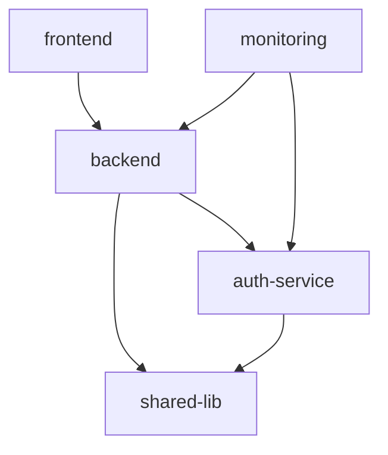

# 🐙 octo

A powerful Git-based system for orchestrating multiple repositories with complex dependencies, coordinated releases, and cross-repository project management.

## Why "octo"?

The name blends **orch**estration with the octopus mascot 🐙 — a fitting metaphor for what this tool does. An octopus coordinates eight independent arms at once, each acting semi-autonomously while the whole animal moves with purpose. `octo` does the same for your repositories: its many "tentacles" reach into every repo in the system and orchestrate them in parallel — syncing branches, resolving cross-repo dependencies, coordinating releases, and monitoring health — all managed as one cohesive, multi-tasking whole.

## 🚀 Features

- **Multi-Repository Coordination**: Manage multiple Git repositories as a cohesive system
- **Dependency Management**: Track and resolve dependencies across repositories
- **Coordinated Releases**: Orchestrate releases across multiple repositories with dependency awareness
- **Cross-Repository Issues**: Create and track epics that span multiple repositories
- **Branch Synchronization**: Keep feature branches synchronized across repositories
- **Health Monitoring**: Track repository health metrics and receive alerts
- **Emergency Rollback**: Coordinated rollback capabilities for production issues
- **Provider Agnostic**: Works with GitHub, GitLab, and Gitea

## 📋 Prerequisites

- Git 2.20+
- Python 3.8+
- GitHub CLI (optional but recommended)
- jq and yq for JSON/YAML processing

## 🛠️ Quick Start

### 1. Bootstrap the Orchestrator

```bash
# Clone octo
git clone https://github.com/tzieba1/octo.git
cd octo

# Run bootstrap script
./scripts/bootstrap.sh

# Activate Python environment
source venv/bin/activate
```

### 2. Configure Your Repositories

Edit `configs/repositories.yaml`:

```yaml
repositories:
  backend:
    url: git@github.com:yourorg/backend.git
    version: 1.2.0
    type: service
    dependencies:
      - name: shared-lib
        version: "^2.0.0"
        type: compile
  
  frontend:
    url: git@github.com:yourorg/frontend.git
    version: 3.1.0
    type: application
    dependencies:
      - name: backend
        version: "^1.0.0"
        type: runtime
```

### 3. Clone Your Repositories

```bash
# Clone all configured repositories
for repo in $(yq e '.repositories | keys | .[]' configs/repositories.yaml); do
    git clone $(yq e ".repositories.$repo.url" configs/repositories.yaml) repos/$repo
done
```

## 📚 Core Commands

### Release Management

```bash
# Prepare a release
./scripts/release/prepare-release.sh v2.0.0 all

# Coordinate the release
./scripts/release/coordinate-release.sh v2.0.0 false

# Emergency rollback
./scripts/release/rollback-release.sh v2.0.1 v2.0.0 all
```

### Version Management

```bash
# Bump version
./scripts/version/bump-version.sh backend minor

# Create release
./scripts/version/create-release.sh backend v1.3.0

# Generate changelog
./scripts/version/changelog.sh backend
```

### Branch Management

```bash
# Create feature branch across repos
./scripts/branch/create-feature.sh new-feature main all

# Create hotfix
./scripts/branch/create-hotfix.sh security-fix v1.2.0 backend

# Cleanup stale branches
./scripts/branch/cleanup-branches.sh false 30
```

### Dependency Management

```bash
# Check dependency status
./scripts/deps/track-dependencies.sh status all

# Update dependencies
./scripts/deps/track-dependencies.sh update backend

# Create dependency lock
./scripts/deps/track-dependencies.sh lock

# Check for conflicts
./scripts/deps/track-dependencies.sh check
```

### Python CLI

```bash
# Check repository health
./scripts/orchestrate.py health

# Coordinate a release
./scripts/orchestrate.py release backend --type minor

# Analyze dependencies
./scripts/orchestrate.py deps
```

## 🏗️ Architecture

### Directory Structure

```
octo/
├── .octo/          # Self-management configuration
├── octo/           # Python orchestration modules
│   ├── version_manager.py  # Version coordination
│   ├── dependency_graph.py # Dependency resolution
│   ├── tracker.py          # Issue tracking
│   ├── monitor.py          # Health monitoring
│   └── providers/          # Provider implementations
├── scripts/                # Orchestration scripts
│   ├── version/            # Version management
│   ├── branch/             # Branch operations
│   ├── release/            # Release coordination
│   └── deps/               # Dependency management
├── configs/                # Configuration files
│   ├── repositories.yaml   # Repository manifest
│   └── dependencies.lock   # Dependency lock file
├── repos/                  # Cloned repositories
├── hooks/                  # Git hooks
└── .github/workflows/      # GitHub Actions
```

### Dependency Resolution

The octo uses a directed graph to track dependencies:



### Release Flow

1. **Preparation**: Create release branches across repositories
2. **Validation**: Run tests and dependency checks
3. **Coordination**: Release in topological order based on dependencies
4. **Propagation**: Update dependent repositories
5. **Verification**: Health checks and monitoring

## 🔧 Configuration

### Repository Configuration

```yaml
repositories:
  repo-name:
    url: git@github.com:org/repo.git
    version: 1.0.0
    type: library|service|application
    dependencies:
      - name: dependency-name
        version: "^1.0.0"  # Semantic versioning
        type: compile|runtime
```

### Dependency Rules

```yaml
dependency_rules:
  resolution: highest-compatible
  lock_strategy: conservative
  update_policy: explicit
```

### Provider Configuration

```bash
# GitHub (using GitHub CLI)
gh auth login

# GitLab
export GITLAB_TOKEN=your-token
export GITLAB_API_URL=https://gitlab.com/api/v4

# Gitea
export GITEA_TOKEN=your-token
export GITEA_API_URL=https://gitea.example.com/api/v1
```

## 🚨 Emergency Procedures

### Rollback Process

1. **Immediate Action**:
   ```bash
   ./scripts/release/rollback-release.sh current-version target-version repos
   ```

2. **Verification**:
   - Check service health
   - Verify monitoring dashboards
   - Test critical paths

3. **Post-Rollback**:
   - Create incident report
   - Update rollback record
   - Plan forward fix

### Recovery from Failed Release

```bash
# Check current state
./scripts/orchestrate.py health

# Identify issues
./scripts/deps/track-dependencies.sh check

# Fix and retry
./scripts/release/coordinate-release.sh version false
```

## 📊 Monitoring

### Health Metrics

- **Activity Level**: Commit frequency and contributor activity
- **Branch Health**: Stale branch detection
- **Dependency Freshness**: Outdated dependency tracking
- **Release Cadence**: Time between releases
- **Test Coverage**: CI/CD success rates

### Automated Health Checks

```yaml
# Runs weekly via GitHub Actions
- Repository activity monitoring
- Dependency conflict detection
- Stale branch identification
- Version drift analysis
```

## 🔄 GitHub Actions Workflows

- **orchestrate-release.yml**: Automated multi-repo release
- **health-check.yml**: Weekly health monitoring
- **sync-repositories.yml**: Configuration synchronization
- **emergency-rollback.yml**: Emergency rollback procedure
- **self-update.yml**: Orchestrator self-management

## 🤝 Contributing

1. Fork the repository
2. Create a feature branch (`orchestrate/feature-name`)
3. Follow conventional commits
4. Add tests for new features
5. Submit a pull request

## 📝 License

MIT License - see LICENSE file for details

## 🆘 Support

- Documentation: `/docs` directory
- Issues: GitHub Issues
- Discussions: GitHub Discussions

## 🎯 Roadmap

- [ ] Web UI for orchestration visualization
- [ ] Kubernetes deployment coordination
- [ ] Terraform infrastructure orchestration
- [ ] Advanced rollback strategies
- [ ] Machine learning for release risk assessment
- [ ] Multi-cloud deployment support

## 🏷️ Version

Current Version: v0.1.0

---

*Built with ❤️ for teams managing complex multi-repository systems*