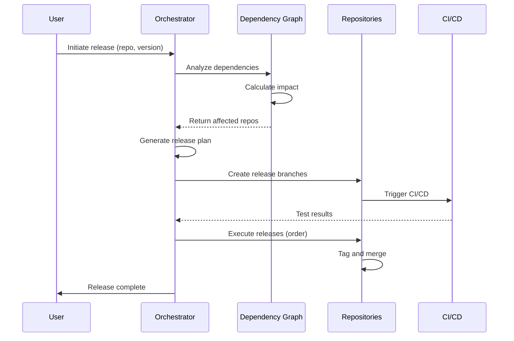
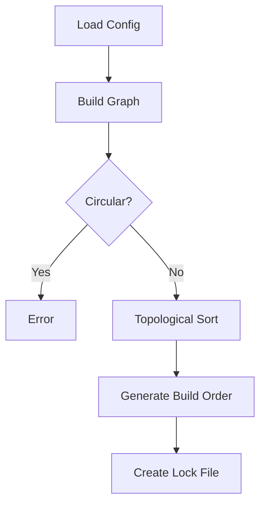

# Repo Orchestrator Architecture

## Overview

Repo Orchestrator is a Git-native multi-repository management system that leverages Git's advanced features (notes, refs, submodules) combined with modern CI/CD practices to orchestrate complex software systems.

## Core Design Principles

### 1. Git-Native Data Storage

Instead of relying on external databases, the orchestrator stores metadata directly in Git:

- **Git Notes**: Store metadata about releases, metrics, and epics
- **Git Refs**: Custom references for dependency tracking
- **Git Config**: Repository-specific settings
- **Git Tags**: Version management and release markers

```bash
# Example: Storing epic metadata in git notes
git notes --ref=epics add -m '{"epic_id": "EP001", "title": "Authentication System"}'

# Custom refs for dependency locks
git update-ref refs/deps/lock $(git write-tree --prefix=deps/)
```

### 2. Provider Abstraction

The system uses an abstract interface pattern to support multiple Git providers:

```python
class ProviderInterface(ABC):
    @abstractmethod
    def create_issue(self, repo, title, body, labels, milestone):
        pass
    
    @abstractmethod
    def create_milestone(self, repo, title, description, due_date):
        pass
```

Implementations:

- `GitHubProvider`: Uses GitHub CLI and REST API
- `GitLabProvider`: Uses GitLab API
- `GiteaProvider`: Uses Gitea API

### 3. Dependency Resolution

Dependencies are tracked as a Directed Acyclic Graph (DAG):

```python
class DependencyResolver:
    def __init__(self):
        self.graph = nx.DiGraph()
    
    def get_build_order(self):
        return list(nx.topological_sort(self.graph))
    
    def check_circular_dependencies(self):
        return list(nx.simple_cycles(self.graph))
```

## Component Architecture

### 1. Version Coordinator

Manages semantic versioning across repositories:

```uml
┌─────────────────────────┐
│   Version Coordinator   │
├─────────────────────────┤
│ - Get current version   │
│ - Calculate bumps       │
│ - Cascade updates       │
│ - Create release plan   │
└─────────────────────────┘
           │
           ▼
┌─────────────────────────┐
│   Dependency Graph      │
├─────────────────────────┤
│ - Find affected repos   │
│ - Calculate order       │
│ - Validate versions     │
└─────────────────────────┘
```

### 2. Issue Tracker

Cross-repository issue and epic management:

```uml
┌─────────────────────────┐
│     Issue Tracker       │
├─────────────────────────┤
│ - Create epics          │
│ - Link issues           │
│ - Track milestones      │
└─────────────────────────┘
           │
           ▼
┌─────────────────────────┐
│   Provider Interface    │
├─────────────────────────┤
│ - GitHub                │
│ - GitLab                │
│ - Gitea                 │
└─────────────────────────┘
```

### 3. Health Monitor

Repository health and metrics collection:

```uml
┌─────────────────────────┐
│    Health Monitor       │
├─────────────────────────┤
│ - Collect metrics       │
│ - Generate reports      │
│ - Trigger alerts        │
└─────────────────────────┘
           │
           ▼
┌─────────────────────────┐
│      Git Analysis       │
├─────────────────────────┤
│ - Commit frequency      │
│ - Branch analysis       │
│ - Contributor stats     │
└─────────────────────────┘
```

## Data Flow

### Release Coordination Flow



### Dependency Resolution Flow



## Storage Schema

### Git Notes Structure

```yaml
# refs/notes/epics
epic:
  epic_id: EP20240115123456
  title: "Authentication System"
  created_at: "2024-01-15T12:34:56Z"
  repositories:
    - backend
    - frontend
    - auth-service
  issues:
    backend: 
      number: 42
      url: "https://github.com/org/backend/issues/42"
```

### Repository Configuration

```yaml
# configs/repositories.yaml
repositories:
  service-name:
    url: git@github.com:org/service.git
    version: 1.2.3
    type: service
    dependencies:
      - name: library-name
        version: "^2.0.0"
        type: compile
```

### Dependency Lock

```yaml
# configs/dependencies.lock
version: 1.0
timestamp: 2024-01-15T12:34:56Z
repositories:
  service-name:
    version: 1.2.3
    dependencies:
      library-name:
        version: "^2.0.0"
        resolved: 2.1.0
```

## Security Considerations

### 1. Authentication

- **GitHub**: Uses GitHub CLI (`gh auth`)
- **GitLab**: Environment variable `GITLAB_TOKEN`
- **Gitea**: Environment variable `GITEA_TOKEN`

### 2. Authorization

- Repository-level permissions inherited from Git provider
- Branch protection rules enforced by provider
- Orchestrator operates with user's permissions

### 3. Audit Trail

All operations are tracked via:

- Git commits (orchestration branches)
- Git notes (metadata storage)
- CI/CD logs (GitHub Actions)
- Issue tracking (provider-specific)

## Scalability

### Handling Large Systems

1. **Lazy Loading**: Repositories cloned on-demand
2. **Sparse Checkouts**: Only required files fetched
3. **Parallel Execution**: Matrix builds in CI/CD
4. **Caching**: Dependency resolution cached

### Performance Optimizations

```python
# Example: Cached dependency resolution
class DependencyResolver:
    def __init__(self):
        self._cache = {}
    
    @lru_cache(maxsize=100)
    def get_dependents(self, repo):
        return list(self.graph.predecessors(repo))
```

## Extension Points

### 1. Custom Providers

```python
class CustomProvider(ProviderInterface):
    def create_issue(self, repo, title, body, labels, milestone):
        # Custom implementation
        pass
```

### 2. Hook System

```bash
# .orchestrator/hooks/pre-release.sh
#!/bin/bash
# Custom pre-release checks
```

### 3. Plugin Architecture

```yaml
# .orchestrator/plugins.yaml
plugins:
  - name: security-scanner
    trigger: pre-release
    command: security-scan.sh
```

## Failure Recovery

### 1. Rollback Mechanism

```bash
# Automatic state preservation
git stash create "pre-rollback-state"

# Revert to known good state
git reset --hard $TARGET_VERSION
```

### 2. Partial Failure Handling

```python
def execute_release_plan(plan, dry_run=False):
    results = {'success': [], 'failed': []}
    
    for repo in plan['execution_order']:
        try:
            release_repository(repo)
            results['success'].append(repo)
        except Exception as e:
            results['failed'].append({'repo': repo, 'error': str(e)})
            # Continue with remaining repos or abort
```

### 3. State Reconciliation

The orchestrator can detect and reconcile inconsistent states:

- Version mismatches
- Incomplete releases
- Dependency conflicts

## Monitoring & Observability

### Metrics Collection

```python
metrics = {
    'repositories': {
        'repo-name': {
            'commit_frequency': 1.5,  # commits/day
            'branch_count': 12,
            'tag_age_days': 30,
            'contributor_count': 5,
            'health_score': 85.0
        }
    }
}
```

### Alert Conditions

- Stale branches (>90 days)
- Inactive repositories (>30 days)
- Dependency drift
- Failed CI/CD pipelines
- Low health scores (<70)

## Future Enhancements

### Planned Features

1. **Web UI**: React-based dashboard
2. **API Server**: RESTful API for orchestration
3. **Kubernetes Integration**: Deploy coordination
4. **ML-based Risk Assessment**: Release risk prediction
5. **Multi-cloud Support**: AWS, GCP, Azure deployments

### Extension Ideas

- Terraform orchestration
- Database migration coordination
- Configuration management
- Secret rotation
- Compliance checking

---

*This architecture is designed to scale from small teams to large enterprises managing hundreds of repositories.*
