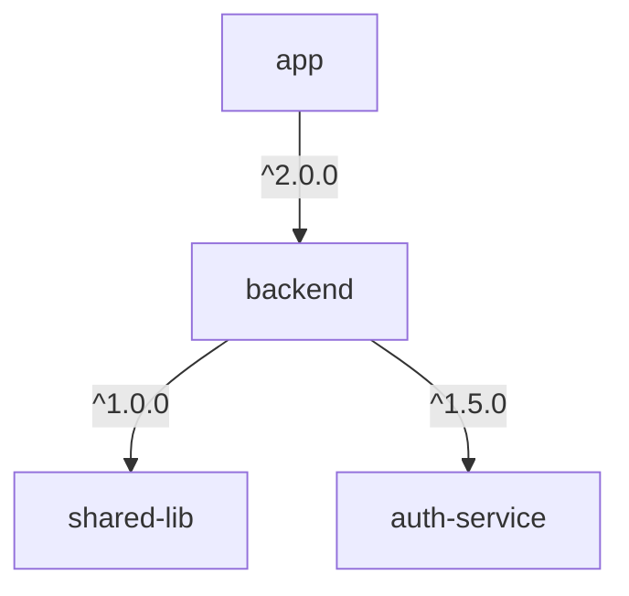

# Dependency Management Guide

## Overview

The Repo Orchestrator provides sophisticated dependency management across multiple repositories, ensuring version consistency and preventing conflicts.

## Dependency Declaration

### Basic Structure

Dependencies are declared in `configs/repositories.yaml`:

```yaml
repositories:
  my-service:
    version: 1.2.0
    dependencies:
      - name: shared-lib
        version: "^2.0.0"
        type: compile
      - name: auth-service
        version: "~1.5.0"
        type: runtime
```

### Version Specifications

We support semantic versioning with the following operators:

| Operator | Example | Meaning |
|----------|---------|---------|
| `^` | `^1.2.3` | Compatible with 1.x.x (>=1.2.3, <2.0.0) |
| `~` | `~1.2.3` | Approximately equivalent (>=1.2.3, <1.3.0) |
| `=` | `=1.2.3` | Exactly this version |
| `>=` | `>=1.2.3` | Greater than or equal |
| `>` | `>1.2.3` | Greater than |
| `<=` | `<=1.2.3` | Less than or equal |
| `<` | `<1.2.3` | Less than |

### Dependency Types

- **compile**: Required at build time
- **runtime**: Required at runtime
- **dev**: Development only
- **optional**: Optional dependency

## Dependency Resolution

### Resolution Strategy

The orchestrator uses a directed acyclic graph (DAG) to resolve dependencies:

1. **Build Graph**: Construct dependency graph from configuration
2. **Detect Cycles**: Check for circular dependencies
3. **Topological Sort**: Determine build/release order
4. **Version Resolution**: Resolve version conflicts

### Example Resolution

```python
from orchestrator import DependencyResolver

resolver = DependencyResolver()

# Get build order
build_order = resolver.get_build_order()
# Result: ['core-lib', 'utils', 'service-a', 'service-b', 'app']

# Get release order (reverse topological)
release_order = resolver.get_release_order(['service-a', 'service-b'])
# Result: ['service-b', 'service-a']
```

## Dependency Commands

### Check Dependencies

```bash
# Check dependency status for all repos
./scripts/deps/track-dependencies.sh status all

# Check for conflicts
./scripts/deps/track-dependencies.sh check

# Create dependency lock file
./scripts/deps/track-dependencies.sh lock
```

### Update Dependencies

```bash
# Update dependencies in a repository
./scripts/deps/track-dependencies.sh update backend

# Update cross-repository dependencies
./scripts/deps/update-cross-deps.sh shared-lib v2.0.0
```

### Install Dependencies

```bash
# Install all dependencies
./scripts/deps/install-deps.sh all development

# Install for specific repository
./scripts/deps/install-deps.sh backend production
```

## Dependency Lock File

The lock file (`configs/dependencies.lock`) ensures reproducible builds:

```yaml
version: 1.0
created: 2024-01-15T10:00:00Z
repositories:
  backend:
    version: 2.0.0
    dependencies:
      shared-lib:
        version: "^1.0.0"
        resolved: 1.2.3
        type: compile
```

## Conflict Resolution

### Automatic Detection

The orchestrator automatically detects version conflicts:

```python
conflicts = resolver.resolve_version_conflicts()
# Returns:
# {
#   'shared-lib': [{
#     'repos': ['service-a', 'service-b'],
#     'specs': ['^1.0.0', '^2.0.0'],
#     'compatible': False
#   }]
# }
```

### Resolution Strategies

1. **Highest Compatible**: Use the highest version that satisfies all constraints
2. **Conservative**: Use the lowest version that satisfies all constraints
3. **Exact**: Require exact version matches
4. **Manual**: Require manual intervention for conflicts

Configure in `repositories.yaml`:

```yaml
dependency_rules:
  resolution: highest-compatible
  conflict_resolution: fail  # fail | warn | auto-resolve
```

## Dependency Visualization

### Generate Dependency Graph

```bash
# Generate visual graph
make visualize

# Or using Python
python -c "from orchestrator import DependencyResolver; \
  resolver = DependencyResolver(); \
  resolver.visualize_graph('deps.png')"
```

### Export to Mermaid

```python
resolver = DependencyResolver()
mermaid_diagram = resolver.export_to_mermaid()
```

Result:



## Impact Analysis

### Analyze Version Changes

```python
impact = resolver.analyze_impact('shared-lib', '2.0.0')
```

Result:

```json
{
  "repository": "shared-lib",
  "current_version": "1.5.0",
  "new_version": "2.0.0",
  "is_breaking_change": true,
  "direct_impact": [
    {
      "repository": "backend",
      "compatible": false,
      "action_required": "update_spec"
    }
  ],
  "transitive_impact": ["frontend", "monitoring"]
}
```

## Best Practices

### 1. Version Pinning

- **Libraries**: Use flexible versions (`^` or `~`)
- **Services**: Consider pinning major versions
- **Production**: Use lock files for reproducibility

### 2. Update Strategy

- **Regular Updates**: Schedule weekly dependency updates
- **Security Updates**: Apply immediately
- **Major Updates**: Plan and test thoroughly

### 3. Testing

Always test dependency updates:

```bash
# Update and test
./scripts/deps/track-dependencies.sh update backend
cd repos/backend
npm test  # or appropriate test command
```

### 4. Documentation

Document dependency decisions:

```yaml
dependencies:
  - name: lodash
    version: "^4.17.21"
    type: compile
    reason: "Utility functions, security updates important"
    
  - name: legacy-api
    version: "=1.2.3"
    type: runtime
    reason: "Pinned due to breaking changes in 1.3.0"
```

## Troubleshooting

### Common Issues

1. **Circular Dependencies**

   ```log
   ERROR: Circular dependency detected: A -> B -> C -> A
   ```

   Solution: Refactor to break the cycle

2. **Version Conflicts**

   ```log
   ERROR: Incompatible versions for shared-lib
   ```

   Solution: Update version specs or use resolution strategy

3. **Missing Dependencies**

    ```log
    ERROR: Dependency 'auth-service' not found
    ```

    Solution: Ensure all dependencies are in `repositories.yaml`

### Debug Commands

```bash
# Verbose dependency check
DEBUG=1 ./scripts/deps/track-dependencies.sh check

# Analyze specific repository
python -c "from orchestrator import DependencyResolver; \
  r = DependencyResolver(); \
  print(r.get_dependency_tree('backend'))"
```

## Advanced Topics

### Custom Resolution

Implement custom resolution logic:

```python
class CustomResolver(DependencyResolver):
    def resolve_version(self, specs):
        # Custom logic here
        return selected_version
```

### Dependency Groups

Group dependencies for easier management:

```yaml
dependency_groups:
  testing:
    - jest: "^29.0.0"
    - eslint: "^8.0.0"
  
  production:
    - express: "^4.18.0"
    - postgres: "^8.0.0"
```

### Automated Updates

Configure automatic dependency updates:

```yaml
# .github/workflows/update-deps.yml
on:
  schedule:
    - cron: '0 9 * * 1'  # Weekly
jobs:
  update:
    steps:
      - run: ./scripts/deps/track-dependencies.sh update all
```

---

*For more information, see [Architecture Documentation](./architecture.md)*
