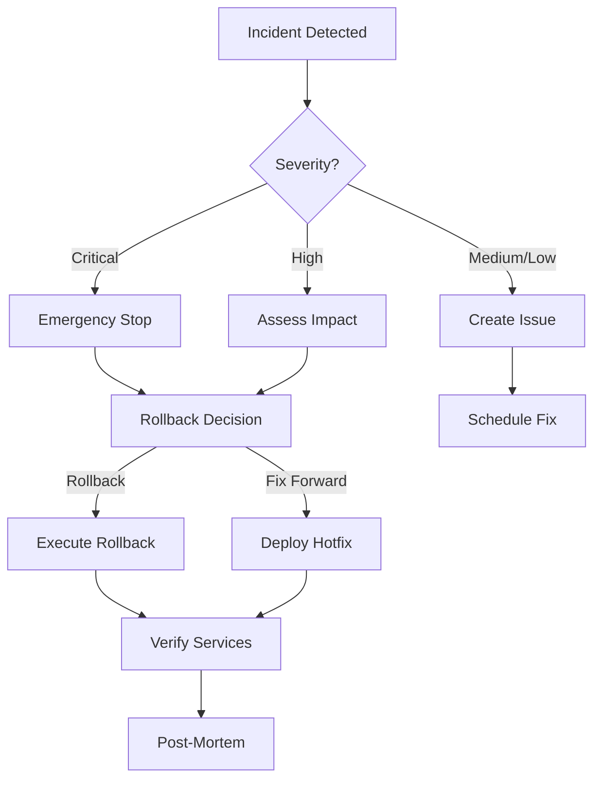

# Disaster Recovery Guide

## Overview

This guide covers emergency procedures, rollback strategies, and recovery processes for the Repo Orchestrator system.

## Emergency Procedures

### 1. Emergency Stop

Immediately halt all orchestration activities:

```bash
# Stop all orchestrator processes
make emergency-stop

# Or manually
pkill -f orchestrator
pkill -f orchestrate.py
```

### 2. Emergency Rollback

#### Quick Rollback

```bash
# Interactive rollback
make rollback

# Direct command
./scripts/release/rollback-release.sh v2.0.1 v2.0.0 all
```

#### Rollback Confirmation

The system requires explicit confirmation:

```bash
⚠️  WARNING: This will rollback production!
Current Version: v2.0.1
Target Version: v2.0.0

Type 'ROLLBACK' to confirm: ROLLBACK
```

### 3. Incident Response Workflow



## Rollback Strategies

### 1. Single Repository Rollback

```bash
# Rollback specific repository
cd repos/backend
git checkout v1.9.0
git push --force-with-lease origin main
```

### 2. Coordinated Rollback

```bash
# Rollback multiple repositories
./scripts/release/rollback-release.sh \
  current-version \
  target-version \
  "backend,frontend,auth-service"
```

### 3. Dependency-Aware Rollback

The orchestrator ensures dependent services are rolled back in the correct order:

```python
# Automatic dependency ordering
rollback_order = resolver.get_release_order(affected_repos)
# Rolls back in reverse dependency order
```

## Recovery Procedures

### 1. State Recovery

#### Check Current State

```bash
# Health check
make health

# Detailed status
./scripts/orchestrate.py health

# Repository status
make status
```

#### Recover from Inconsistent State

```bash
# Synchronize configurations
git pull origin main
./scripts/bootstrap.sh

# Validate configurations
make validate

# Re-sync repositories
make pull-all
```

### 2. Data Recovery

#### Restore from Git History

```bash
# Restore orchestrator configuration
git checkout HEAD~1 -- configs/repositories.yaml

# Restore from specific date
git checkout `git rev-list -n 1 --before="2024-01-14" main` -- configs/

# Restore from git notes
git notes --ref=metrics show HEAD~10
```

#### Backup Recovery

```bash
# Restore from backup
tar -xzf orchestrator-backup-20240114.tar.gz
cp -r backup/configs/* configs/

# Restore repository states
for repo in repos/*; do
  cd $repo
  git fetch --all
  git reset --hard origin/main
  cd -
done
```

### 3. Dependency Recovery

#### Fix Broken Dependencies

```bash
# Check dependencies
./scripts/deps/track-dependencies.sh check

# Force dependency update
./scripts/deps/track-dependencies.sh update all

# Regenerate lock file
rm configs/dependencies.lock
./scripts/deps/track-dependencies.sh lock
```

## Rollback Scenarios

### Scenario 1: Failed Release

**Symptoms**: Services failing after release

**Recovery**:

```bash
# 1. Immediate rollback
./scripts/release/rollback-release.sh v2.0.0 v1.9.9 all

# 2. Verify services
curl health-check-endpoints

# 3. Create incident
gh issue create --title "Release v2.0.0 Failed" \
  --label incident,rollback
```

### Scenario 2: Partial Deployment

**Symptoms**: Some services updated, others failed

**Recovery**:

```bash
# 1. Identify affected services
./scripts/orchestrate.py health

# 2. Rollback affected only
./scripts/release/rollback-release.sh v2.0.0 v1.9.9 \
  "service-a,service-b"

# 3. Retry failed services
./scripts/release/coordinate-release.sh v2.0.0 false
```

### Scenario 3: Dependency Mismatch

**Symptoms**: Services can't communicate due to version mismatch

**Recovery**:

```python
# 1. Analyze dependencies
from orchestrator import DependencyResolver
resolver = DependencyResolver()
conflicts = resolver.resolve_version_conflicts()

# 2. Fix versions
# Update configs/repositories.yaml

# 3. Re-deploy
./scripts/release/coordinate-release.sh v2.0.1 false
```

## Monitoring During Recovery

### Real-time Monitoring

```bash
# Watch repository status
watch -n 5 'make status'

# Monitor health scores
while true; do
  make health | grep "Health Score"
  sleep 10
done

# Check service endpoints
for url in $(cat endpoints.txt); do
  curl -s -o /dev/null -w "%{http_code}" $url
  echo " - $url"
done
```

### Metrics Collection

```bash
# Collect emergency metrics
python << EOF
from orchestrator import RepoHealthMonitor
monitor = RepoHealthMonitor()
metrics = monitor.collect_metrics()

# Save for analysis
import json
with open('emergency_metrics.json', 'w') as f:
    json.dump(metrics, f, indent=2)
EOF
```

## Post-Incident

### 1. Generate Report

```bash
# Create incident report
cat > incident_report.md << EOF
# Incident Report: $(date +%Y-%m-%d)

## Summary
- **Time**: $(date)
- **Severity**: Critical/High/Medium
- **Impact**: Services affected
- **Resolution**: Rollback/Hotfix

## Timeline
- Detection: 
- Response:
- Resolution:

## Root Cause
[Analysis]

## Lessons Learned
[Improvements]
EOF
```

### 2. Update Runbooks

```yaml
# Add to .orchestrator/runbooks/
runbook:
  scenario: "Service Communication Failure"
  symptoms:
    - HTTP 503 errors
    - Timeout between services
  diagnosis:
    - Check version compatibility
    - Verify network connectivity
  resolution:
    - Rollback if version mismatch
    - Scale services if overloaded
```

### 3. Improve Automation

```python
# Add automated recovery
class AutoRecovery:
    def detect_failure(self):
        # Health check logic
        pass
    
    def auto_rollback(self):
        if self.detect_failure():
            subprocess.run([
                "./scripts/release/rollback-release.sh",
                current_version,
                last_known_good
            ])
```

## Prevention

### 1. Pre-release Checks

```yaml
# Enhanced pre-release validation
pre_release_checks:
  - dependency_validation
  - integration_tests
  - smoke_tests
  - performance_tests
  - security_scan
```

### 2. Staged Rollouts

```bash
# Deploy to staging first
./scripts/release/coordinate-release.sh v2.0.0 --env staging

# Verify staging
./scripts/test/integration-test.sh staging

# Then production
./scripts/release/coordinate-release.sh v2.0.0 --env production
```

### 3. Automated Backups

```bash
# Backup before release
cat > .github/workflows/backup.yml << 'EOF'
on:
  workflow_dispatch:
  schedule:
    - cron: '0 2 * * *'

jobs:
  backup:
    steps:
      - name: Backup configurations
        run: |
          tar -czf backup-$(date +%Y%m%d).tar.gz \
            configs/ \
            .orchestrator/ \
            .git/notes
EOF
```

## Emergency Contacts

Configure in `.orchestrator/emergency.yaml`:

```yaml
contacts:
  on_call:
    - name: DevOps Lead
      phone: "+1-555-0100"
      email: devops@example.com
  
  escalation:
    - level: 1
      contact: team-lead@example.com
      wait: 15m
    - level: 2
      contact: director@example.com
      wait: 30m
    - level: 3
      contact: cto@example.com
      wait: 1h

notifications:
  channels:
    - pagerduty
    - slack: "#incidents"
    - email: incidents@example.com
```

## Quick Reference Card

```bash
# Emergency Commands Cheatsheet
# =============================

# STOP everything
make emergency-stop

# ROLLBACK production
./scripts/release/rollback-release.sh CURRENT TARGET all

# CHECK health
make health

# VIEW status
make status

# SYNC configurations
git pull && make validate

# FIX dependencies
./scripts/deps/track-dependencies.sh check
./scripts/deps/track-dependencies.sh update all

# CREATE incident
gh issue create --title "INCIDENT: ..." --label incident

# GENERATE report
./scripts/incident/generate-report.sh

# Contact on-call
./scripts/notify/page-oncall.sh "Emergency rollback needed"
```

## Testing Disaster Recovery

### Conduct Drills

```bash
# Disaster recovery drill
./scripts/test/dr-drill.sh

# Simulates:
# - Service failure
# - Rollback procedure
# - Recovery verification
# - Report generation
```

### Chaos Engineering

```python
# Randomly fail services to test recovery
import random
import subprocess

def chaos_test():
    repos = ['backend', 'frontend', 'auth']
    victim = random.choice(repos)
    
    # Simulate failure
    subprocess.run(['kill', '-9', f'$(pgrep -f {victim})'])
    
    # Wait for auto-recovery
    time.sleep(60)
    
    # Verify recovery
    health = check_health(victim)
    assert health == 'healthy'
```

---

*Remember: In an emergency, staying calm and following the runbook is crucial. When in doubt, rollback first and investigate later.*
